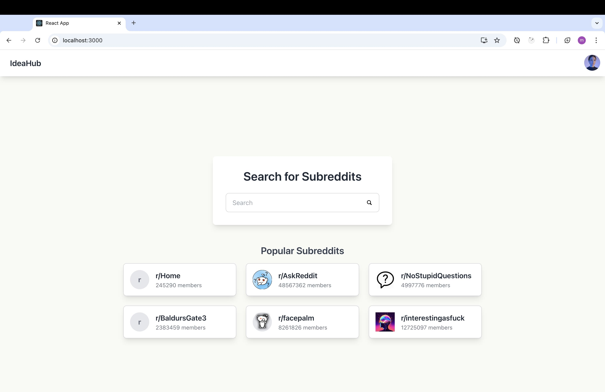
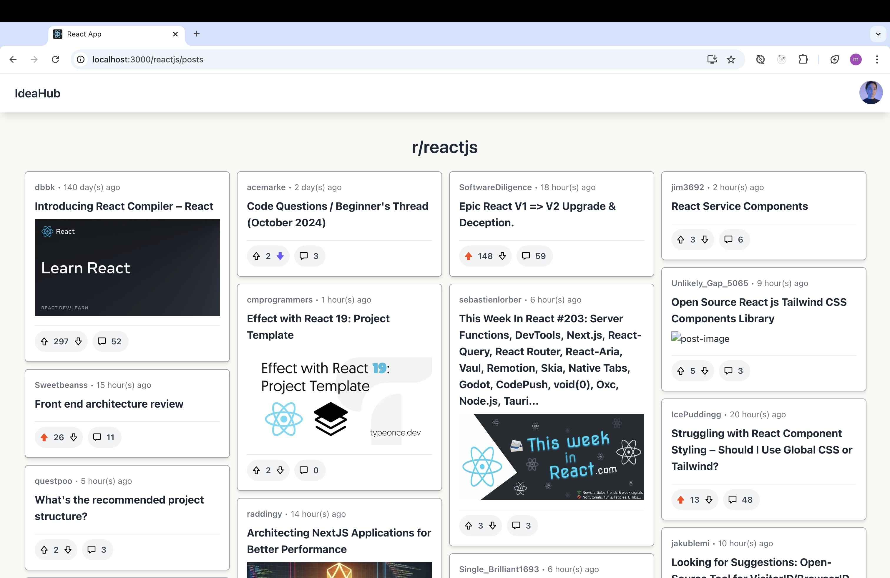
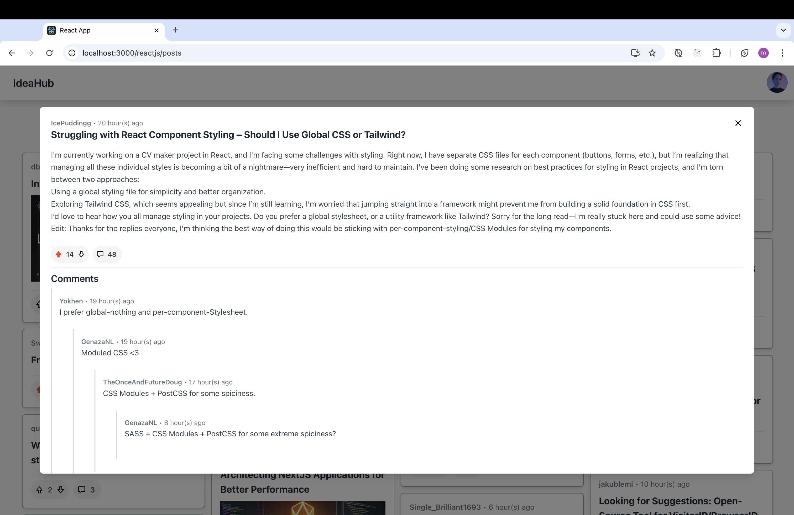

# IdeaHub

## Project Description

**IdeaHub** is a Reddit client clone that allows users to explore, search, and interact with subreddits, posts, and comments using an alternative interface to the official Reddit platform. The application is designed to provide a smooth and intuitive experience while showcasing key features like browsing popular subreddits and diving deep into posts and discussions.

This project is part of the **JetBrains internship** application, demonstrating proficiency in building front-end applications with React, integrating external APIs, and managing state effectively.

## Features Implemented

- **Subreddit Browsing**: Discover and search for popular subreddits with real-time data.
- **Post Exploration**: View and interact with posts, including seeing the number of upvotes and comments.
- **Comment Threads**: Dive into post comments, including nested replies, to engage with Reddit discussions.
- **Seamless Reddit API Integration**: Fetches live data from the Reddit API to ensure up-to-date content.

## Project Structure

This is a **React** application that serves as the front-end for exploring Reddit. The app uses the **Reddit API** to retrieve data about subreddits, posts, and comments, offering a simplified, alternative user interface.

### Technologies Used

- **React**: Front-end library for building user interfaces.
- **TypeScript**: Static type-checking for improved code reliability.
- **Tailwind CSS**: Utility-first CSS framework for styling.
- **Reddit API**: Fetching real-time subreddit, post, and comment data.
- **Axios**: For making HTTP requests.
- **React Router**: For handling in-app navigation.

### Prerequisites

Before setting up the project, ensure you have the following installed on your machine:

- **Node.js (v14 or later)**: Download [Node.js](https://nodejs.org/en)
- **Yarn**: If not installed, run `npm install --global yarn`

### Installation

Follow these steps to set up the project locally:

1. Clone the repository
2. `cd` to IdeaHub
3. Run `yarn` or `yarn install` to install all the dependencies
4. Create a `.env` file in the root directory and add the following environment variables: `REACT_APP_ACCESS_TOKEN=<your_reddit_access_token>`
5. Run `yarn start` to start the development server

#### How to get an Access Token for the Reddit API

To make authenticated requests to the Reddit API, you will need an access token. Follow these steps to obtain it:

1. [Create a Reddit Application](https://www.reddit.com/prefs/apps) --> Choose "script"
2. Request an Access Token: Use `curl` or a similar tool to send a POST request to the Reddit API:

    ```
    curl -X POST -d "grant_type=password&username=your_reddit_username&password=your_reddit_password"
    --user "your_client_ID:your_client_secret" https://www.reddit.com/api/v1/access_token
    ```

3. You will receive a response containing an access_token. Use this in the .env file as `REACT_APP_ACCESS_TOKEN`.
4. If the token expires, simply run that command again and copy the token.

## Design Decisions

To start, since I decided to build a Reddit clone, I included an initial separate page to search for subreddits. I also featured the **six most popular** ones to give users a clearer idea of the page's purpose.

Next, I wanted to redesign the posts in a **masonry layout**, as I liked the idea of posts with different content fitting together. For this design choice, I opted for a modal to display post details and comments.

In the comments section, I aimed to provide a better visualization of nested comments to enhance user experience (UX).

## Challenges Faced

The first challenge was building the posts masonry layout. I had a clear concept in mind but encountered difficulties implementing it from scratch. As a result, I used this package, which delivers decent results: [react-masonry-css](https://github.com/paulcollett/react-masonry-css). Unfortunately, sometimes, when loading posts with a lot of content, the column heights break, and this is still an issue to be resolved: [GitHub issue](https://github.com/paulcollett/react-masonry-css/issues/86).

The second challenge was understanding the Reddit API since it was my first time working with it. Initially, I had to consult the documentation to identify the structure of various objects used in requests and responses.

## DEMO




